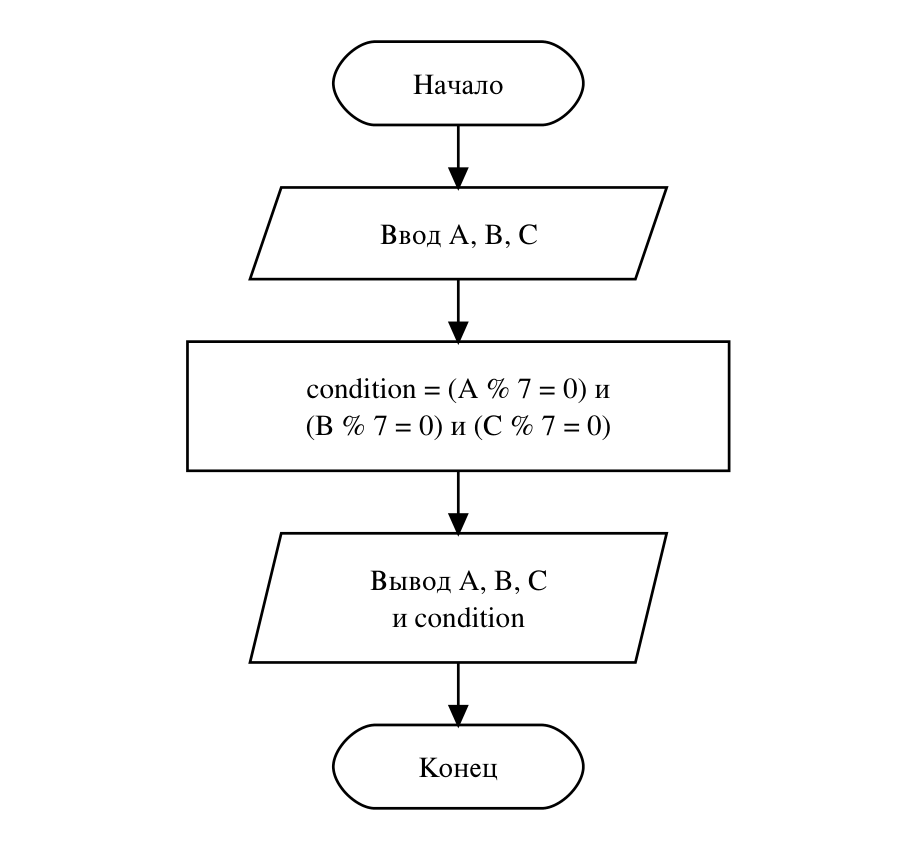

# Домашнее задание к работе №4
Вариант 10

## Условие задачи
**Фабрика игрушек.** Контроль качества на фабрике игрушек пропускает партию, если вес каждой из трех случайно выбранных игрушек (A, B, C грамм) кратен семи. Это свидетельствует о соблюдении технологических норм. Запишите условие принятия партии.

## 1. Алгоритм и блок-схема
### Алгоритм:
1. Начало.
2. Объявить переменные:
- **A, B, C** — вес трех игрушек в граммах;
- **condition** — результат проверки (1 — партия принята, 0 — нет).
3. Ввести A, B, C.
4. Вычислить условие **condition = (A % 7 == 0) && (B % 7 == 0) && (C % 7 == 0)**.
5. Вывести вес игрушек и значение условия.
6. Конец.

### Блок-схема:


## 2. Реализация программы
```c
#define _CRT_SECURE_NO_DEPRECATE
#include <stdio.h>
#include <locale.h>

// Вариант 10. Фабрика игрушек
// Партия принимается, если вес каждой из трех игрушек (A, B, C грамм) кратен семи
int main() {
    setlocale(LC_CTYPE, "RUS");
    int A, B, C;
    int condition;
    printf("=== КОНТРОЛЬ КАЧЕСТВА ФАБРИКИ ИГРУШЕК ===\n");
    printf("Введите вес трех игрушек в граммах (A B C): ");
    scanf("%d %d %d", &A, &B, &C); // ввод веса трех игрушек
    condition = (A % 7 == 0) && (B % 7 == 0) && (C % 7 == 0); // 1, если каждый вес делится на 7 без остатка, иначе 0
    printf("Вес игрушек: A = %d г, B = %d г, C = %d г\n", A, B, C);
    printf("Партия принята (1 - да, 0 - нет): %d\n", condition);
    return 0;
}
```

## 3. Результаты работы программы
Случай 1:
```
=== КОНТРОЛЬ КАЧЕСТВА ФАБРИКИ ИГРУШЕК ===
Введите вес трех игрушек в граммах (A B C): 14 21 70
Вес игрушек: A = 14 г, B = 21 г, C = 70 г
Партия принята (1 - да, 0 - нет): 1
```
Случай 2:
```
=== КОНТРОЛЬ КАЧЕСТВА ФАБРИКИ ИГРУШЕК ===
Введите вес трех игрушек в граммах (A B C): 14 22 70
Вес игрушек: A = 14 г, B = 22 г, C = 70 г
Партия принята (1 - да, 0 - нет): 0
```

## 4. Информация о разработчике
Файко Андрей Юрьевич, бТИИ-262
